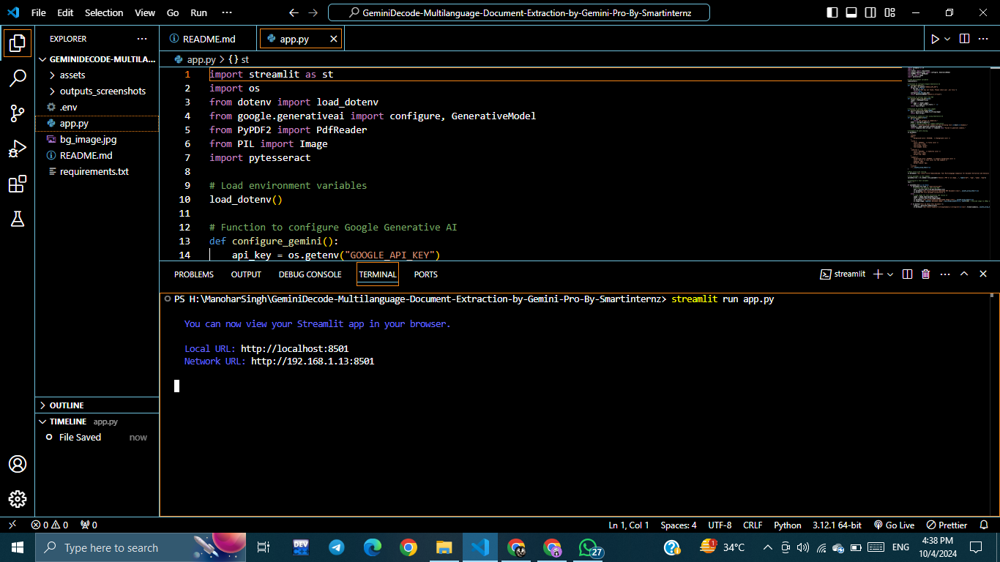
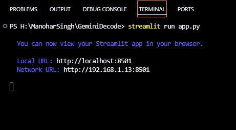
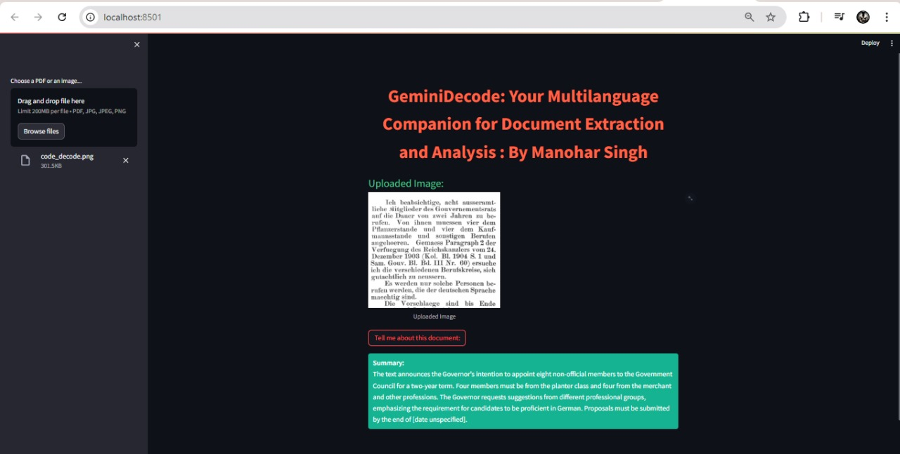
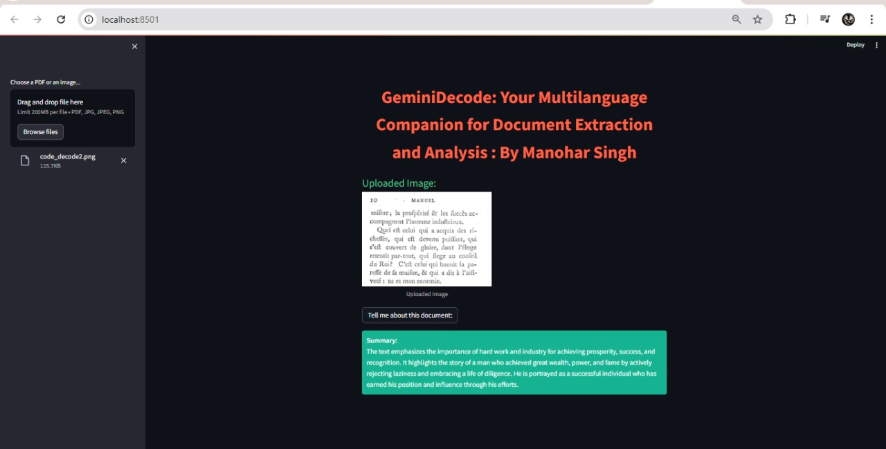

# GeminiDecode: Multilanguage Document Extraction by Gemini Pro

**GeminiDecode** is a cutting-edge solution designed to extract and process data from documents in multiple languages with unparalleled efficiency. Leveraging advanced natural language processing (NLP) and machine learning algorithms, it seamlessly identifies, extracts, and categorizes information from diverse document formats, ensuring accuracy and speed. Ideal for global businesses, GeminiDecode supports over 50 languages, providing robust data extraction capabilities that streamline workflows, enhance productivity, and improve decision-making processes.

## Features

- **Multilanguage Support:** Extracts data from documents in over 50 languages.
- **Advanced NLP and ML:** Utilizes cutting-edge natural language processing and machine learning algorithms.
- **Efficiency and Accuracy:** Ensures high accuracy and speed in data extraction and processing.
- **Versatile Document Formats:** Supports diverse document formats.

## Project Flow

1. **User Interaction:** The user interacts with the UI to enter the input.
2. **Data Transmission:** User input is collected from the UI and transmitted to the backend using the Google API key.
3. **Model Processing:** The input is forwarded to the Gemini Pro pre-trained model via an API call.
4. **Result Generation:** The Gemini Pro pre-trained model processes the input and generates the output.
5. **Output Display:** The results are returned to the frontend for formatting and display.

### Screenshots





## Requirements

To run this project, you need to have:

- Python 3.x installed on your machine.
- A valid Google API key for accessing the Gemini API.

## Installation

1. Clone this repository :

   ```bash
   git clone https://github.com/ManoharSingh1311/GeminiDecode-Multilanguage-Document-Extraction-by-Gemini-Pro-By-Smartinternz.git
   cd GeminiDecode-Multilanguage-Document-Extraction-by-Gemini-Pro-By-Smartinternz

   ```

2. Create a `.env` file in the project root directory and add your Google API key:

   `GOOGLE_API_KEY=YOUR_GOOGLE_API_KEY`

3. Install the required libraries:

   `pip install -r requirements.txt`

### Usage

Run the Streamlit application:

    streamlit run app.py

Open your web browser and navigate to http://localhost:8501.

Upload a PDF document and enter your prompt to extract information.

### Prior Knowledge Required

You should have prior knowledge of the following topics to complete this project:

    - Generative AI Concepts
    - Natural Language Processing (NLP)
    - Generative AI
    - About Gemini
    - Gemini API
    - Gemini Demo
    - Streamlit

### Contributing

If you want to contribute to this project, feel free to open issues or submit pull requests. Your contributions are welcome!

### License

This project is licensed under the MIT License - see the LICENSE file for details.

### Acknowledgments

Thanks to Google for providing the Gemini API. Special thanks to the contributors and the community for their support.

Created by: Sanjay Singh Kunwar
Email: sanjaykunwar24@gmail.com

